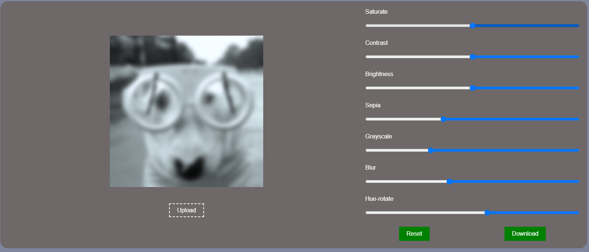

# 🖼️ Image Editor Web App

A lightweight and easy-to-use browser-based image editor. Users can upload their images and apply real-time filters like brightness, saturation, blur, grayscale, sepia, and more — all using simple CSS manipulations. It also supports image downloading and reset functionality.

---

## 🚀 Features

- 📤 Upload your own image
- 🎚️ Apply filters:
  - Brightness
  - Contrast
  - Saturate
  - Sepia
  - Grayscale
  - Blur
  - Hue-Rotate
- 💾 Download the edited image
- ♻️ Reset all filters with one click
- 🖥️ Simple and responsive UI

---

## 📸 Screenshot

> _(You can replace the image path with a real one hosted on your repo or CDN)_



---

## 🛠️ How to Use

1. Clone the repository:

   ```bash
   git clone https://github.com/your-username/image-editor.git
